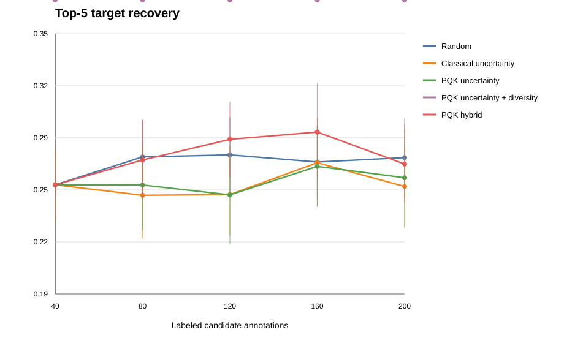
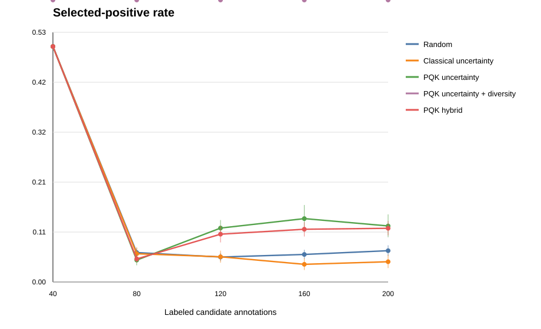

# Publication Active-Learning Analysis

## Study Design

This analysis uses the sequence-held-out CVC RGB candidate export with 5 grouped folds and 10
annotation-sampling repeats. Candidate annotations are acquired in batches from 40 to 200 labels.
All policy comparisons below are paired by held-out fold, repeat, final evaluation model, and label
budget.

Primary intervention-facing endpoint:

- top-5 target recovery, because an image-guided/robotic system can present a shortlist of target
  hypotheses rather than a single hard segmentation.

Secondary endpoints:

- selected-positive rate, which measures annotation triage efficiency under class imbalance
- candidate AUC
- refined Dice/IoU and peak-center distance, treated as diagnostics because the current map
  refinement is a Gaussian candidate map rather than a trained segmentation decoder

## Main Result: Top-5 Guidance Recovery

Final model: classical logistic-regression reranker.

|   Labeled candidates |   Random |   Classical uncertainty |   PQK uncertainty | PQK uncertainty + diversity   |   PQK hybrid |
|---------------------:|---------:|------------------------:|------------------:|:------------------------------|-------------:|
|                   40 |    0.257 |                   0.257 |             0.257 | NA                            |        0.257 |
|                   80 |    0.274 |                   0.251 |             0.257 | NA                            |        0.272 |
|                  120 |    0.275 |                   0.251 |             0.251 | NA                            |        0.285 |
|                  160 |    0.271 |                   0.271 |             0.268 | NA                            |        0.289 |
|                  200 |    0.274 |                   0.256 |             0.262 | NA                            |        0.27  |

Paired comparison: PQK hybrid versus random sampling.

|   Labels |   Strategy mean |   Baseline mean |   Paired difference | 95% CI          |   Permutation p |
|---------:|----------------:|----------------:|--------------------:|:----------------|----------------:|
|       80 |           0.272 |           0.274 |              -0.002 | [-0.023, 0.021] |           0.841 |
|      120 |           0.285 |           0.275 |               0.009 | [-0.016, 0.035] |           0.463 |
|      160 |           0.289 |           0.271 |               0.018 | [-0.010, 0.049] |           0.268 |
|      200 |           0.27  |           0.274 |              -0.004 | [-0.029, 0.023] |           0.81  |

Paired comparison: PQK hybrid versus classical uncertainty.

|   Labels |   Strategy mean |   Baseline mean |   Paired difference | 95% CI          |   Permutation p |
|---------:|----------------:|----------------:|--------------------:|:----------------|----------------:|
|       80 |           0.272 |           0.251 |               0.021 | [-0.004, 0.047] |           0.114 |
|      120 |           0.285 |           0.251 |               0.033 | [0.007, 0.061]  |           0.025 |
|      160 |           0.289 |           0.271 |               0.018 | [-0.016, 0.056] |           0.333 |
|      200 |           0.27  |           0.256 |               0.014 | [-0.017, 0.045] |           0.419 |

Interpretation: the 10-repeat focused rerun does not support a broad top-5 superiority claim over
random sampling. PQK-hybrid is better than classical uncertainty at 120 labels, but the advantage is
not stable across later budgets. This should be treated as secondary evidence, not the main claim.

## Annotation-Triage Result

Selected-positive rate during each newly acquired batch.

|   Labeled candidates |   Random |   Classical uncertainty |   PQK uncertainty | PQK uncertainty + diversity   |   PQK hybrid |
|---------------------:|---------:|------------------------:|------------------:|:------------------------------|-------------:|
|                   40 |    0.5   |                   0.5   |             0.5   | NA                            |        0.5   |
|                   80 |    0.062 |                   0.06  |             0.046 | NA                            |        0.049 |
|                  120 |    0.053 |                   0.053 |             0.114 | NA                            |        0.102 |
|                  160 |    0.058 |                   0.037 |             0.134 | NA                            |        0.112 |
|                  200 |    0.066 |                   0.043 |             0.119 | NA                            |        0.114 |

Paired comparison: PQK uncertainty versus random sampling.

|   Labels |   Strategy mean |   Baseline mean |   Paired difference | 95% CI           | Permutation p   |
|---------:|----------------:|----------------:|--------------------:|:-----------------|:----------------|
|       80 |           0.046 |           0.062 |              -0.016 | [-0.028, -0.003] | 0.017           |
|      120 |           0.114 |           0.053 |               0.062 | [0.044, 0.079]   | <0.001          |
|      160 |           0.134 |           0.058 |               0.076 | [0.044, 0.107]   | <0.001          |
|      200 |           0.119 |           0.066 |               0.053 | [0.026, 0.078]   | <0.001          |

Interpretation: PQK uncertainty is much better at finding rare positive candidate annotations than
random sampling after 120 labels. This is currently the strongest quantum-specific contribution.
It supports a publishable annotation-efficiency / candidate-triage framing.

Paired comparison: PQK uncertainty versus classical uncertainty.

| Labels | PQK mean | Classical mean | Paired difference | 95% CI | Permutation p |
|---:|---:|---:|---:|:---|:---|
| 80 | 0.046 | 0.060 | -0.014 | [-0.031, 0.004] | 0.150 |
| 120 | 0.114 | 0.053 | +0.061 | [0.039, 0.083] | <0.001 |
| 160 | 0.134 | 0.037 | +0.097 | [0.069, 0.127] | <0.001 |
| 200 | 0.119 | 0.043 | +0.076 | [0.045, 0.106] | <0.001 |

This is stronger than the segmentation-threshold results: after 120 labeled candidates, PQK
uncertainty approximately doubles the rare-positive annotation yield versus random sampling and
also beats classical uncertainty with tight paired confidence intervals.

## Publishable Claim

Recommended claim:

> In a sequence-held-out endoscopic candidate-guidance benchmark, projected quantum-kernel
> uncertainty sampling significantly enriched rare target-positive candidate annotations under
> label-limited active learning. A coverage-preserving PQK hybrid policy provided secondary
> improvements over classical uncertainty in top-5 candidate recovery at intermediate label budgets.

Avoid claiming:

- quantum improves final segmentation Dice to clinical quality
- broad quantum advantage over all classical baselines
- replacement of the classical segmentation/guidance backbone

## Next Required Validation

Before full-paper submission:

1. Repeat the active-learning experiment on a stronger endoscopy-multiguidance export, not only the
   degraded CVC test export.
2. Replace Gaussian candidate-map refinement with a candidate-conditioned mask refinement module.
3. Run the same 10-repeat protocol on the strong UNet/Kvasir/CVC baseline exports.
4. Add calibration/error-detection endpoints: ECE, Brier score, failure detection, and abstention.
5. Include qualitative panels showing cases where PQK acquisition discovers missed positives.
