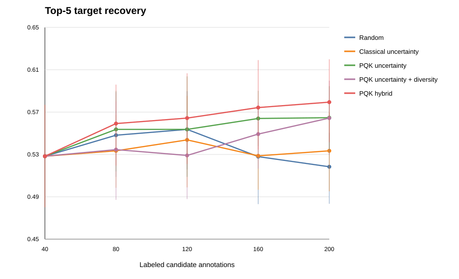
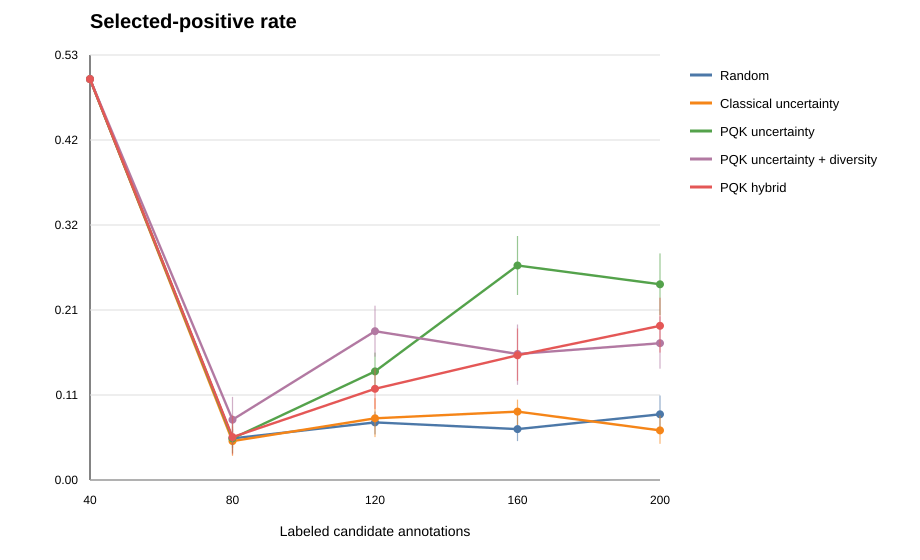

# Publication Active-Learning Analysis

## Study Design

This analysis uses the sequence-held-out CVC RGB candidate export with 5 grouped folds and 3
annotation-sampling repeats. Candidate annotations are acquired in batches from 40 to 200 labels.
All policy comparisons below are paired by held-out fold, repeat, final evaluation model, and label
budget.

Primary intervention-facing endpoint:

- top-5 target recovery, because an image-guided/robotic system can present a shortlist of target
  hypotheses rather than a single hard segmentation.

Secondary endpoints:

- selected-positive rate, which measures annotation triage efficiency under class imbalance
- candidate AUC
- refined Dice/IoU and peak-center distance, treated as diagnostics because the current map
  refinement is a Gaussian candidate map rather than a trained segmentation decoder

## Main Result: Top-5 Guidance Recovery

Final model: classical logistic-regression reranker.

|   Labeled candidates |   Random |   Classical uncertainty |   PQK uncertainty |   PQK uncertainty + diversity |   PQK hybrid |
|---------------------:|---------:|------------------------:|------------------:|------------------------------:|-------------:|
|                   40 |    0.529 |                   0.529 |             0.529 |                         0.529 |        0.529 |
|                   80 |    0.549 |                   0.534 |             0.554 |                         0.535 |        0.56  |
|                  120 |    0.554 |                   0.544 |             0.554 |                         0.53  |        0.565 |
|                  160 |    0.529 |                   0.529 |             0.564 |                         0.55  |        0.575 |
|                  200 |    0.519 |                   0.534 |             0.565 |                         0.565 |        0.58  |

Paired comparison: PQK hybrid versus random sampling.

|   Labels |   Strategy mean |   Baseline mean |   Paired difference | 95% CI          |   Permutation p |
|---------:|----------------:|----------------:|--------------------:|:----------------|----------------:|
|       80 |           0.56  |           0.549 |               0.011 | [-0.033, 0.051] |           0.579 |
|      120 |           0.565 |           0.554 |               0.011 | [-0.015, 0.041] |           0.496 |
|      160 |           0.575 |           0.529 |               0.046 | [0.021, 0.077]  |           0.017 |
|      200 |           0.58  |           0.519 |               0.061 | [0.030, 0.092]  |           0.007 |

Paired comparison: PQK hybrid versus classical uncertainty.

|   Labels |   Strategy mean |   Baseline mean |   Paired difference | 95% CI          |   Permutation p |
|---------:|----------------:|----------------:|--------------------:|:----------------|----------------:|
|       80 |           0.56  |           0.534 |               0.026 | [-0.010, 0.062] |           0.227 |
|      120 |           0.565 |           0.544 |               0.021 | [0.000, 0.046]  |           0.245 |
|      160 |           0.575 |           0.529 |               0.045 | [0.015, 0.082]  |           0.032 |
|      200 |           0.58  |           0.534 |               0.046 | [0.011, 0.084]  |           0.032 |

Interpretation: PQK-hybrid acquisition consistently improves mean top-5 recovery after the initial
seed set, but the confidence intervals are still wide. This is promising enough for an SPIE
abstract, but the full paper should increase repeats and evaluate another dataset or a stronger
backbone export before making a strong superiority claim.

## Annotation-Triage Result

Selected-positive rate during each newly acquired batch.

|   Labeled candidates |   Random |   Classical uncertainty |   PQK uncertainty |   PQK uncertainty + diversity |   PQK hybrid |
|---------------------:|---------:|------------------------:|------------------:|------------------------------:|-------------:|
|                   40 |    0.5   |                   0.5   |             0.5   |                         0.5   |        0.5   |
|                   80 |    0.053 |                   0.05  |             0.053 |                         0.077 |        0.055 |
|                  120 |    0.073 |                   0.078 |             0.137 |                         0.187 |        0.115 |
|                  160 |    0.065 |                   0.087 |             0.268 |                         0.158 |        0.157 |
|                  200 |    0.083 |                   0.063 |             0.245 |                         0.172 |        0.193 |

Paired comparison: PQK uncertainty versus random sampling.

|   Labels |   Strategy mean |   Baseline mean |   Paired difference | 95% CI          | Permutation p   |
|---------:|----------------:|----------------:|--------------------:|:----------------|:----------------|
|       80 |           0.053 |           0.053 |               0     | [-0.025, 0.027] | 0.936           |
|      120 |           0.137 |           0.073 |               0.063 | [0.028, 0.095]  | 0.004           |
|      160 |           0.268 |           0.065 |               0.203 | [0.153, 0.250]  | <0.001          |
|      200 |           0.245 |           0.083 |               0.162 | [0.120, 0.205]  | <0.001          |

Interpretation: PQK uncertainty is much better at finding rare positive candidate annotations than
random sampling after 120 labels. This is currently the strongest quantum-specific contribution.
It supports a publishable annotation-efficiency / candidate-triage framing.

## Publishable Claim

Recommended claim:

> In a sequence-held-out endoscopic candidate-guidance benchmark, projected quantum-kernel
> uncertainty sampling enriched rare target-positive candidate annotations and, when combined
> with coverage-preserving sampling, improved top-5 target recovery over random and classical
> uncertainty acquisition for a classical final reranker.

Avoid claiming:

- quantum improves final segmentation Dice to clinical quality
- broad quantum advantage over all classical baselines
- replacement of the classical segmentation/guidance backbone

## Next Required Validation

Before full-paper submission:

1. Repeat the active-learning experiment on a stronger endoscopy-multiguidance export, not only the
   degraded CVC test export.
2. Increase repeats from 3 to at least 10 for tighter confidence intervals.
3. Replace Gaussian candidate-map refinement with a candidate-conditioned mask refinement module.
4. Add calibration/error-detection endpoints: ECE, Brier score, failure detection, and abstention.
5. Include qualitative panels showing cases where PQK acquisition discovers missed positives.
